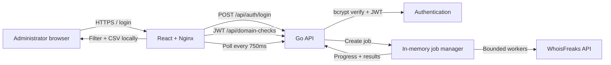
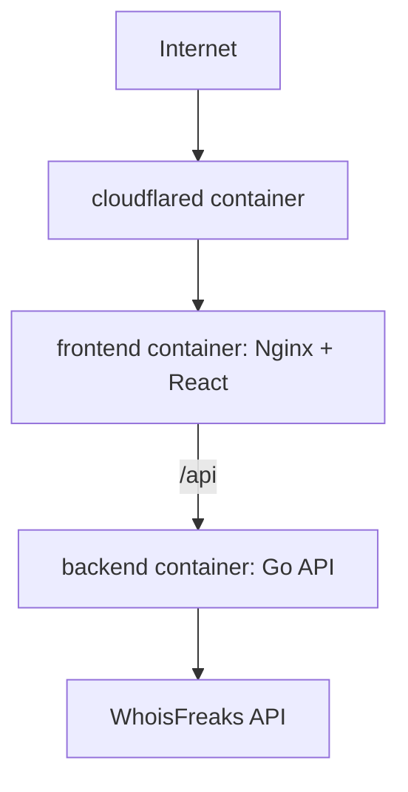

# Architecture

## System overview

## Request flow

1. The administrator posts credentials; Go rate-limits attempts, checks bcrypt, and returns an expiring JWT.
2. The browser stores the token in `sessionStorage` and sends it as a Bearer token to protected APIs.
3. Batch input is normalized again on the backend, invalid entries are returned as validation details, and a UUID job is created.
4. A worker pool consumes domains with configured bounded concurrency. A reusable `net/http` client applies context timeouts and selective exponential retries.
5. Each completed check updates a mutex-protected job result and counters. Individual failures become `ERROR`, so the batch still completes.
6. The client polls status, renders actual completed/total progress, filters in memory, and writes CSV locally.
7. A cleanup loop removes finished jobs after retention; shutdown cancels background work and drains the server gracefully.

## Technology choices and limits

Go provides low-overhead concurrent I/O, a compact compiled deployment, `context.Context`, and a strong standard HTTP library. A worker pool avoids 100 simultaneous vendor requests. React, TypeScript, Vite, and Tailwind provide a small typed UI; Nginx serves the SPA and isolates the backend Compose hostname. JWT plus bcrypt fits the single-account scope. Polling is simpler than sockets for a max-100 internal batch.

No database, Redis, or queue is used deliberately: jobs are transient and this supports one instance. Consequently jobs disappear after restart and horizontal scaling would need shared job storage/queue (for example Redis). Polling adds small periodic traffic. Cloudflare Tunnel is optional and adds a managed external dependency.

## Security and networking

The WhoisFreaks key is backend environment only and never logged in an upstream URL. Passwords are bcrypt hashes; login errors are generic; JWT expiry, request size limits, CORS allowlisting, recovery, security headers, and sanitized request logs are enabled. `sessionStorage` limits persistence but does not protect against XSS, so production should also use CSP and trusted content practices. Containers use minimal runtime images and non-root users; no Docker socket or privileged capability is used. Only frontend port 3000 is published; backend is internal. Cloudflare terminates public TLS when the optional tunnel profile routes to frontend. Cloudflare Access is a recommended future layer.

## API contract

| Endpoint | Auth | Result |
|---|---:|---|
| `POST /api/auth/login` | no | `{ token, expiresAt }`; 401 for bad credentials, 429 rate limit |
| `POST /api/domain-checks` | JWT | `{ jobId, status, total }`; 422 for invalid domains |
| `GET /api/domain-checks/:jobId` | JWT | status, progress, summary, results; 404 for missing/expired job |
| `GET /api/health` | no | `{ status: "ok" }` |

Errors use `{ "error": { "code": "...", "message": "...", "details": [] } }`. Domain creation accepts `{ "domains": ["example.com"] }`; details enumerate invalid raw entries. Status output follows `AVAILABLE`, `TAKEN`, and `ERROR`, including a nullable error string and RFC3339 checked timestamp.
