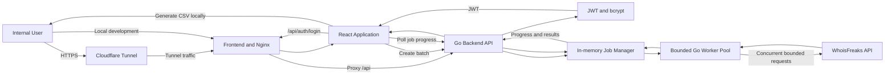
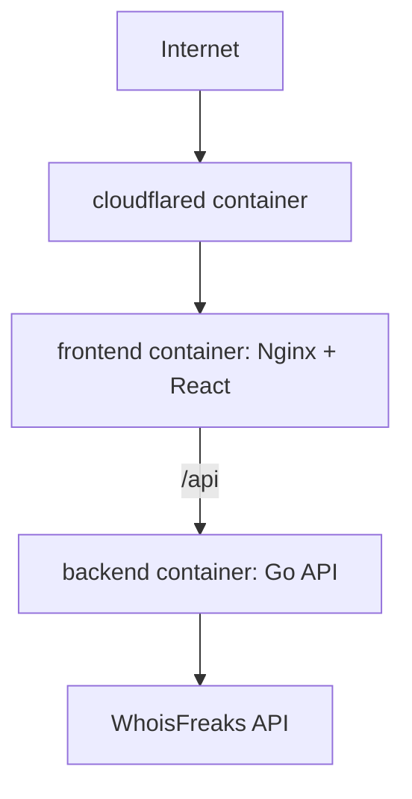

# Agentic Implementation Prompt — Bulk Domain Availability Checker

## Role

You are a senior full-stack engineer responsible for planning, designing, implementing, testing, containerizing, and documenting an internal **Bulk Domain Availability Checker**.

Work directly inside the provided repository. Do not create an unrelated project outside the existing structure.

The initial repository structure is:

```text
live-coding-rumahweb/
├── .env.example
├── AI_USAGE.md
├── ARCHITECTURE.md
├── PLANNING.md
└── code/
```

## Core Technology Direction

Use the following primary stack:

### Frontend

* React.
* TypeScript.
* Vite.
* Tailwind CSS.

### Backend

* Go.
* Go standard library or a lightweight HTTP router such as Chi.
* JWT authentication.
* bcrypt password verification.
* Goroutines with controlled concurrency.
* In-memory transient job management.

### Deployment and Infrastructure

* Docker.
* Docker Compose.
* Nginx for serving the built frontend and proxying API requests when appropriate.
* Cloudflare Tunnel through `cloudflared` for optional external publishing.

Do not replace Go with Node.js, Python, or another backend language.

---

# 1. Important Instructions

1. Inspect the existing repository before modifying anything.
2. Preserve the existing top-level structure.
3. Do **not** modify `AI_USAGE.md`. The project owner will complete it separately.
4. Complete `PLANNING.md` and `ARCHITECTURE.md`.
5. Place the complete runnable application inside `code/`.
6. Provide a complete Docker Compose setup.
7. Include an optional `cloudflared` service for external publishing.
8. Do not leave placeholder implementations, fake API responses, unfinished TODOs, or pseudocode in the final result.
9. Keep the implementation appropriately scoped for a live-coding assignment.
10. Avoid unnecessary enterprise complexity.
11. Make reasonable assumptions where details are unavailable, but document every important assumption in `PLANNING.md`.
12. Use secure defaults.
13. Never expose secrets, plaintext passwords, JWT secrets, Cloudflare tokens, or the WhoisFreaks API key to the frontend.
14. After implementation, run the relevant formatting, linting, testing, build, and Docker validation commands.
15. Fix errors before declaring the task complete.
16. If external API access is unavailable during development, implement the real integration and test it using mocks.
17. Do not replace production integration with hardcoded results.
18. Do not merely describe what should be implemented. Actually create and modify the required files.
19. Prefer simple, readable, maintainable Go code over unnecessary abstractions.
20. Ensure the application can run both:

    * Directly in local development.
    * Through Docker Compose.

---

# 2. Product Overview

Build an internal web application that allows an authenticated administrator to check the availability of **1–100 domains in one batch**.

The primary workflow is:

```text
Login
  ↓
Paste or type up to 100 domains
  ↓
Validate and normalize input
  ↓
Start availability checking
  ↓
Show actual batch progress
  ↓
Display result summary and table
  ↓
Filter, search, and export results as CSV
```

The UX should take inspiration from the simplicity of tools such as iLovePDF:

* One clearly defined task per screen.
* Large central input area.
* Prominent primary action.
* Minimal distractions.
* Clear processing state.
* Clear result summary.
* Easy way to start another batch.

Do not copy iLovePDF branding, assets, wording, or visual identity. Only use its straightforward interaction flow as UX inspiration.

---

# 3. Functional Requirements

## 3.1 Authentication

The system only needs one internal administrator account.

Requirements:

* Use JWT for authentication.
* Use bcrypt to verify the administrator password.
* Do not store or compare plaintext passwords.
* Do not implement registration.
* Do not implement user management.
* Do not implement password recovery.
* Protect all domain-checking endpoints with JWT authentication.
* Provide a logout action.
* Store the login session in `sessionStorage`, unless a better documented alternative is selected.
* Configure JWT expiration through an environment variable.
* Use a sensible default such as eight hours.
* Return generic errors for invalid credentials.
* Apply basic login rate limiting if practical.

Suggested environment variables:

```env
APP_ENV=development

BACKEND_PORT=8080
FRONTEND_PORT=3000

JWT_SECRET=replace-with-a-long-random-secret
JWT_EXPIRES_IN=8h

ADMIN_USERNAME=admin
ADMIN_PASSWORD_HASH=replace-with-a-bcrypt-hash

WHOISFREAKS_API_KEY=replace-with-the-api-key
WHOISFREAKS_BASE_URL=https://api.whoisfreaks.com/v1.0

DOMAIN_CHECK_CONCURRENCY=5
DOMAIN_CHECK_TIMEOUT_SECONDS=10
DOMAIN_CHECK_MAX_RETRIES=2

JOB_RETENTION_MINUTES=30
JOB_CLEANUP_INTERVAL_MINUTES=5

CORS_ALLOWED_ORIGINS=http://localhost:3000

CLOUDFLARE_TUNNEL_TOKEN=
PUBLIC_APP_URL=
```

Update `.env.example` with:

* Every required variable.
* Safe example values.
* Brief comments where useful.
* No real credentials or tokens.

The real `.env` file must not be committed.

---

## 3.2 Domain Input

The administrator must be able to enter between 1 and 100 domains.

Accept input separated by:

* New lines.
* Commas.
* Semicolons.
* Whitespace.

Examples:

```text
example.com
example.id
example.net
```

```text
example.com, example.id; example.net
```

Normalize input before processing:

* Trim whitespace.
* Convert domains to lowercase.
* Remove `http://` and `https://`.
* Remove paths.
* Remove query strings.
* Remove fragments.
* Remove trailing slashes.
* Handle a trailing domain dot safely.
* Remove duplicate domains.
* Validate domain syntax.
* Reject an empty batch.
* Reject more than 100 unique valid domains.
* Clearly report invalid inputs without crashing the application.

Do not silently classify invalid input as `TAKEN`.

Show the administrator:

* Number of detected entries.
* Number of valid domains.
* Number of duplicates removed.
* Invalid entries.
* Maximum batch size of 100.

Backend validation is authoritative even when frontend validation is also provided.

---

## 3.3 WhoisFreaks Integration

Use the WhoisFreaks Domain Availability API.

Single-domain request format:

```bash
curl "https://api.whoisfreaks.com/v1.0/domain/availability?domain=<DOMAIN>&apiKey=<API_KEY>"
```

The API key must only be used by the Go backend.

Never:

* Send the WhoisFreaks API key to the browser.
* Include the API key in frontend source code.
* Return the API key in an error message.
* Log the complete upstream URL containing the API key.
* Commit a real API key.
* Include secrets in Docker images.
* Include secrets in frontend build arguments.

Implement the upstream request defensively:

* Use `net/http` with a configured HTTP client.
* Configure connection and request timeouts.
* Propagate `context.Context`.
* Handle non-2xx responses.
* Handle malformed JSON.
* Handle unexpected response fields.
* Handle quota or rate-limit errors.
* Handle DNS and network errors.
* Handle partial batch failures.
* Do not abort the entire batch when one domain fails.
* Retry only transient failures.
* Use a small retry limit.
* Use backoff between retries.
* Respect request cancellation where practical.
* Do not retry deterministic validation or authentication failures.
* Safely reuse the HTTP client rather than creating a new client for every request.

Normalize every result into one internal schema:

```go
type DomainCheckStatus string

const (
    DomainStatusAvailable DomainCheckStatus = "AVAILABLE"
    DomainStatusTaken     DomainCheckStatus = "TAKEN"
    DomainStatusError     DomainCheckStatus = "ERROR"
)

type DomainCheckResult struct {
    Domain    string            `json:"domain"`
    Status    DomainCheckStatus `json:"status"`
    CheckedAt time.Time         `json:"checkedAt"`
    Error     *string           `json:"error"`
}
```

Map WhoisFreaks response values defensively:

```text
AVAILABLE    → AVAILABLE
UNAVAILABLE  → TAKEN
Unknown      → ERROR
Missing      → ERROR
Failed check → ERROR
```

Do not assume every upstream response always has the expected structure.

---

## 3.4 Batch Processing and Progress

The system must process up to 100 domains without:

* Freezing the browser.
* Launching 100 uncontrolled simultaneous requests.
* Holding one fragile HTTP request open until every check finishes.
* Leaking goroutines.
* Losing successful results because one domain fails.
* Exhausting upstream connections.
* Blocking unrelated API requests.

Use an in-memory asynchronous batch job mechanism in the Go backend.

Recommended flow:

```text
POST /api/domain-checks
  → Authenticate request
  → Validate and normalize domains
  → Create an in-memory job
  → Return job ID immediately
  → Start background processing

Background worker pool
  → Read domains from job queue
  → Check domains with bounded concurrency
  → Update completed count and results safely

GET /api/domain-checks/:jobId
  → Authenticate request
  → Return job status, progress, summary, and results
```

Use one of the following controlled concurrency patterns:

* Fixed worker pool using goroutines and channels.
* Semaphore using a buffered channel.
* `errgroup` with an explicit concurrency limit.

Do not run 100 uncontrolled goroutines without a concurrency limit.

A recommended default is:

```text
5 concurrent WhoisFreaks requests
```

The concurrency limit must be configurable.

Use proper synchronization for shared job state:

* `sync.RWMutex`.
* Channels where appropriate.
* Atomic counters only where they improve clarity.
* Avoid unsynchronized map access.
* Avoid data races.

Run tests with the Go race detector where practical:

```bash
go test -race ./...
```

Example job status:

```json
{
  "jobId": "generated-id",
  "status": "PROCESSING",
  "progress": {
    "total": 100,
    "completed": 45,
    "percentage": 45
  },
  "summary": {
    "available": 14,
    "taken": 29,
    "error": 2
  },
  "results": []
}
```

Possible job states:

```text
QUEUED
PROCESSING
COMPLETED
FAILED
```

Requirements:

* Progress must be based on actually completed checks.
* Show text such as `45 of 100 domains checked`.
* Disable duplicate submission while a batch is running.
* Allow a batch to complete even when individual domains fail.
* Clean expired jobs from memory.
* Configure job retention and cleanup interval through environment variables.
* Do not persist jobs or results in a database.
* Results may disappear after page refresh, backend restart, or container restart.
* Document this transient behavior.
* Do not use Redis, PostgreSQL, RabbitMQ, Kafka, or another queue unless explicitly justified.
* The final implementation should remain simple and suitable for one application instance.

The frontend should poll the job status endpoint every 500–1000 milliseconds.

Polling must stop when:

* The job is complete.
* The job fails.
* The user logs out.
* The component is unmounted.
* The request is cancelled.
* A terminal error occurs.

---

## 3.5 Results Dashboard

After processing completes, show summary cards for:

* Total.
* Available.
* Taken.
* Error.

Display a responsive results table with at least:

| Column     | Description                |
| ---------- | -------------------------- |
| Domain     | Normalized domain          |
| Status     | Available, Taken, or Error |
| Checked At | Check timestamp            |
| Detail     | Error detail when relevant |

Provide:

* Filter: `All`.
* Filter: `Available`.
* Filter: `Taken`.
* Filter: `Error`.
* Client-side domain search.
* Visible result count after filtering.
* Clear text-based status badges.
* Empty-state messages.
* A `Check New Domains` action.
* An `Export CSV` action.

Do not make the results table unnecessarily complex.

---

## 3.6 CSV Export

CSV export must work without storing data in a database.

Support:

* Export all results.
* Export currently filtered results.

CSV columns:

```csv
domain,status,checked_at,error_message
```

Requirements:

* Escape commas correctly.
* Escape quotation marks correctly.
* Escape line breaks correctly.
* Generate a meaningful filename.

Example:

```text
domain-availability-2026-07-15T10-30-00.csv
```

* Generate CSV from results already held by the frontend.
* Export normalized statuses.
* Produce UTF-8-compatible output.
* Consider including a UTF-8 BOM if needed for compatibility with spreadsheet applications.

---

## 3.7 Login Page

Create a simple login page containing:

* Application name.
* Username input.
* Password input.
* Sign-in button.
* Loading state.
* Generic invalid-credentials message.
* Accessible form labels.
* Password input masking.
* Keyboard submission support.

Do not expose whether the username or password was individually incorrect.

Use:

```text
Invalid username or password.
```

---

## 3.8 Main Checker UX

The main checker page should contain:

* Compact header.
* Application name.
* Logout action.
* Clear title.
* Short explanation.
* Large central textarea.
* Input guidance.
* Live valid-domain count.
* Primary `Check Availability` button.
* Processing state.
* Actual batch progress bar.
* Result summary.
* Filter controls.
* Search input.
* Responsive results table.
* CSV export.
* Start-new-check action.

Prioritize desktop usability while keeping the interface usable on mobile screens.

Include accessibility basics:

* Proper labels.
* Keyboard navigation.
* Visible focus states.
* Sufficient contrast.
* Status communicated through text, not color alone.
* Appropriate disabled states.
* `aria` attributes for progress.
* Clear error messages.

---

# 4. Infrastructure and Deployment Requirements

## 4.1 Docker

Create production-ready but lightweight Dockerfiles for:

* Go backend.
* React frontend.

Use multi-stage builds.

### Backend Dockerfile

Expected approach:

1. Use a Go builder image.
2. Download dependencies.
3. Build a statically linked or minimal Go binary.
4. Copy the binary into a small runtime image.
5. Run as a non-root user where practical.
6. Expose only the backend application port.
7. Include a health check or support the Compose health check.

Do not include source code or build caches unnecessarily in the final runtime image.

### Frontend Dockerfile

Expected approach:

1. Use a Node builder image.
2. Install dependencies.
3. Build the Vite frontend.
4. Copy static files into an Nginx runtime image.
5. Configure Nginx to serve the single-page application.
6. Proxy `/api` requests to the backend service if this architecture is selected.
7. Include appropriate cache headers.
8. Avoid caching `index.html` too aggressively.

The browser must never need direct access to the backend's internal Compose hostname.

---

## 4.2 Docker Compose

Create:

```text
code/docker-compose.yml
```

The Compose setup should contain:

```text
frontend
backend
cloudflared
```

The `cloudflared` service should be optional or activated through a Compose profile.

Recommended service flow:

```text
Internet
   ↓
Cloudflare Tunnel
   ↓
Frontend/Nginx
   ↓ /api
Go Backend
   ↓
WhoisFreaks API
```

The frontend or reverse proxy should be the primary public entry point.

Suggested Compose behavior:

* `frontend` depends on a healthy backend where useful.
* `backend` receives secrets from environment variables.
* `cloudflared` receives `CLOUDFLARE_TUNNEL_TOKEN`.
* Only publish local host ports needed for development.
* Internal service communication uses the Compose network.
* Add restart policies suitable for prototyping.
* Add health checks.
* Avoid mounting the Docker socket.
* Avoid running containers in privileged mode.
* Avoid exposing backend ports publicly unless needed for local debugging.
* Do not put secrets directly inside `docker-compose.yml`.

Example service concept:

```yaml
services:
  backend:
    build:
      context: ./server
    env_file:
      - .env
    expose:
      - "8080"
    healthcheck:
      test: ["CMD", "/app/backend", "healthcheck"]
      interval: 10s
      timeout: 3s
      retries: 5

  frontend:
    build:
      context: ./client
    ports:
      - "${FRONTEND_PORT:-3000}:80"
    depends_on:
      backend:
        condition: service_healthy

  cloudflared:
    image: cloudflare/cloudflared
    command: tunnel --no-autoupdate run
    environment:
      TUNNEL_TOKEN: ${CLOUDFLARE_TUNNEL_TOKEN}
    depends_on:
      frontend:
        condition: service_started
    profiles:
      - tunnel
```

The exact syntax may be adjusted according to the final implementation.

Validate Compose configuration using:

```bash
docker compose config
```

---

## 4.3 Cloudflare Tunnel

Include optional support for publishing the application through Cloudflare Tunnel.

Requirements:

* Use the official `cloudflared` container image.
* Read the tunnel token from an environment variable.
* Never commit a tunnel token.
* Do not hardcode the public hostname.
* Document how to create and configure the tunnel.
* Document where the tunnel should route traffic.
* Route public traffic to the frontend/Nginx service.
* Let Nginx proxy `/api` requests internally to the Go backend.
* Ensure the backend is not unnecessarily exposed directly to the internet.
* Document how to start the tunnel profile.

Example command:

```bash
docker compose --profile tunnel up --build
```

Also support running without Cloudflare Tunnel:

```bash
docker compose up --build
```

Document that Cloudflare Tunnel provides connectivity but does not replace application authentication.

Do not assume Cloudflare Access is enabled.

Mention Cloudflare Access as an optional future defense-in-depth enhancement, not a required dependency.

---

# 5. Recommended Technology Choices

Use the following stack unless repository constraints strongly suggest otherwise.

## Frontend

* React.
* TypeScript.
* Vite.
* Tailwind CSS.
* Native `fetch` or a small request abstraction.
* React hooks and local application state.
* No Redux unless there is a demonstrated need.
* No heavy component library unless justified.

## Backend

* Go.
* Lightweight router such as Chi, or Go standard `net/http`.
* JWT implementation using a maintained Go JWT library.
* bcrypt through `golang.org/x/crypto/bcrypt`.
* Runtime request validation through explicit Go validation.
* `net/http` for WhoisFreaks integration.
* `context.Context` for timeouts and cancellation.
* Worker pool or semaphore for bounded concurrency.
* `sync.RWMutex` for safe in-memory job access.
* Structured logging using Go's standard structured logger or a small logging library.

## Testing

* Go `testing` package.
* `httptest`.
* Table-driven tests.
* Go race detector.
* Vitest.
* React Testing Library where useful.

Avoid adding tools that do not provide meaningful value for this assignment.

---

# 6. Required Repository Deliverables

## 6.1 `PLANNING.md`

Populate `PLANNING.md` with the following sections.

### A. Scope Summary

Explain:

* What the application does.
* Who uses it.
* What is included.
* What is intentionally excluded.

Explicitly state that the system:

* Uses one administrator account.
* Does not have registration.
* Does not permanently store domain results.
* Checks a maximum of 100 domains per batch.
* Integrates with WhoisFreaks through the Go backend.
* Uses Docker Compose for local deployment.
* Supports optional external publishing through Cloudflare Tunnel.

### B. Task Breakdown

Break the work into tasks and subtasks.

Each task must contain:

* Task name.
* Objective.
* Subtasks.
* Dependencies.
* Estimated duration.
* Definition of completion.

Example:

```markdown
## Task 1 — Repository and Project Setup

Estimated time: 30 minutes

### Objective

Prepare the Go backend, React frontend, Docker configuration, and development workflow.

### Subtasks

- Inspect the starter repository.
- Initialize the Go module.
- Initialize the React and TypeScript frontend.
- Configure environment loading.
- Add formatting and test scripts.
- Create initial Dockerfiles.
- Create the Docker Compose skeleton.

### Dependencies

None.

### Completion criteria

- Frontend and backend run locally.
- Environment validation works.
- Docker Compose configuration is valid.
- No secrets are committed.
```

Include at least:

1. Repository inspection and setup.
2. Go backend initialization.
3. React frontend initialization.
4. Authentication.
5. Domain parsing and validation.
6. WhoisFreaks API client.
7. Concurrent batch job manager.
8. Progress polling.
9. Results dashboard.
10. CSV export.
11. Dockerfiles.
12. Docker Compose.
13. Cloudflare Tunnel integration.
14. Testing.
15. Documentation.
16. Final verification.

Provide realistic estimates.

Include a total estimated implementation time.

### C. Questions for the Product Manager

List at least five questions that ideally should be clarified before coding.

For every question include:

* The question.
* Why it matters.
* What implementation decision it affects.
* The default assumption used when no answer is available.

Questions should address meaningful uncertainties such as:

* What WhoisFreaks plan and rate limits apply?
* Which deployment host will run Docker Compose?
* Will multiple administrators use the application concurrently?
* Should internationalized domain names be supported?
* How long should transient jobs remain available?
* What should happen after a browser refresh?
* Should failed domains be retried automatically?
* Are all public top-level domains expected to work?
* Should CSV export default to all or filtered results?
* Is Cloudflare Access expected in addition to JWT authentication?
* What public hostname will be used?
* Should local deployment support HTTPS independently of Cloudflare?
* Are audit logs required?
* Is one Compose instance sufficient?
* What maximum expected number of simultaneous batches exists?

Do not ask questions whose answers are already explicitly stated in this prompt.

Proceed using documented assumptions unless implementation is impossible.

### D. Edge Cases

Identify and explain relevant edge cases.

#### Input edge cases

* Empty input.
* Only whitespace.
* Duplicate domains.
* Mixed separators.
* URLs instead of domains.
* Uppercase domains.
* Paths and query strings.
* Invalid labels.
* Consecutive dots.
* Missing top-level domain.
* Domain longer than allowed.
* Label longer than allowed.
* More than 100 unique domains.
* Internationalized domain names.
* Trailing dot.
* Unicode whitespace.
* Duplicate domains after normalization.
* Unsupported schemes.
* Inputs containing ports.
* Email addresses accidentally pasted into the field.

#### API edge cases

* Timeout.
* Rate limit.
* Invalid API key.
* Expired or exhausted quota.
* Upstream 5xx response.
* Invalid JSON response.
* Missing availability field.
* Unknown availability value.
* Network interruption.
* One failed domain among successful domains.
* Slow upstream response.
* Retry exhaustion.
* Context cancellation.
* Duplicate polling request.
* WhoisFreaks becoming temporarily unavailable.

#### Concurrency edge cases

* Multiple batches running at once.
* Job deletion while being read.
* Backend shutdown during processing.
* Goroutine leak.
* Channel not closed correctly.
* Shared map access without synchronization.
* More completed workers than expected.
* Duplicate result insertion.
* Worker panic.
* Cleanup process removing an active job.
* Race between completion and polling.
* Concurrency set to zero or an invalid value.

#### Authentication edge cases

* Missing token.
* Invalid token.
* Expired token.
* Incorrect credentials.
* Missing environment variables.
* Invalid bcrypt hash.
* Token remaining in the browser after server restart.
* User logs out while polling.
* Login brute-force attempts.

#### UI edge cases

* Page refresh during processing.
* User clicks submit multiple times.
* User logs out during processing.
* Results contain very long domain names.
* No result matches the selected filter.
* CSV contains quotes or special characters.
* API returns all errors.
* Polling temporarily fails.
* Backend container restarts.
* Cloudflare Tunnel is temporarily disconnected.

#### Docker and deployment edge cases

* Backend health check fails.
* Frontend starts before backend is ready.
* Missing `.env`.
* Missing Cloudflare tunnel token.
* Tunnel profile started without configuration.
* Port already in use.
* Container receives termination signal.
* Cloudflare hostname points to the wrong service.
* Nginx cannot resolve the backend service.
* Backend is accidentally exposed publicly.
* Stale frontend assets after deployment.

Explain expected handling for each important edge case.

### E. Assumptions

Document assumptions and explain why each assumption is reasonable.

At minimum include:

* Results are transient.
* No database is used.
* Jobs are stored in Go process memory.
* The application initially runs as a single backend instance.
* Controlled concurrency defaults to five.
* Go goroutines and a worker pool perform domain checks.
* The frontend polls for progress.
* JWT is stored in `sessionStorage`.
* One administrator is configured through environment variables.
* Failed domains do not fail the complete batch.
* CSV is generated client-side.
* The UI is inspired by iLovePDF's workflow but does not copy its branding.
* An `ERROR` status exists alongside `AVAILABLE` and `TAKEN`.
* Internationalized domains are converted through IDNA/Punycode or explicitly rejected.
* Docker Compose is the primary prototyping and deployment method.
* Cloudflare Tunnel is optional.
* Cloudflare Tunnel routes to the frontend service.
* The frontend reverse proxy forwards `/api` traffic to the backend.
* Cloudflare Tunnel does not replace JWT authentication.
* Horizontal scaling is not supported without moving job state to shared storage.

---

## 6.2 `ARCHITECTURE.md`

Populate `ARCHITECTURE.md` with the following sections.

### A. Architecture Overview

Explain:

* React frontend.
* Nginx static hosting and reverse proxy.
* Go backend.
* JWT and bcrypt authentication.
* Transient job manager.
* Worker pool.
* WhoisFreaks API integration.
* Docker Compose networking.
* Optional Cloudflare Tunnel.

### B. System Flow Diagram

Include a Mermaid diagram or readable ASCII diagram.

Example:



Also include a Docker Compose diagram:



### C. Request Flow

Describe:

1. Login request.
2. bcrypt password verification.
3. JWT generation.
4. Domain parsing.
5. Domain normalization.
6. Batch job creation.
7. Worker-pool processing.
8. WhoisFreaks requests.
9. Progress updates.
10. Frontend polling.
11. Result filtering.
12. CSV generation.
13. Job expiration.
14. Graceful backend shutdown.
15. Docker Compose startup.
16. Cloudflare Tunnel routing.

### D. Technology Choices

Explain the selection and trade-offs of:

* Go.
* Goroutines.
* Worker pool or semaphore.
* `context.Context`.
* `net/http`.
* React.
* TypeScript.
* Vite.
* Tailwind CSS.
* Nginx.
* JWT.
* bcrypt.
* In-memory job storage.
* Polling.
* Docker.
* Docker Compose.
* Cloudflare Tunnel.
* Go testing.
* Vitest.

Explain why Go was chosen:

* Efficient concurrent I/O.
* Lightweight runtime.
* Straightforward deployment as a compiled binary.
* Good fit for bounded concurrent API requests.
* Low operational overhead.

Also explain limitations:

* In-memory jobs prevent straightforward horizontal scaling.
* Container restart loses active jobs.
* Polling creates periodic HTTP traffic.
* Cloudflare Tunnel adds an external infrastructure dependency when enabled.

### E. Proposed Folder Structure

Use a structure similar to:

```text
code/
├── README.md
├── Makefile
├── .dockerignore
├── .gitignore
├── docker-compose.yml
├── client/
│   ├── Dockerfile
│   ├── nginx.conf
│   ├── package.json
│   ├── vite.config.ts
│   ├── tsconfig.json
│   └── src/
│       ├── api/
│       ├── components/
│       ├── features/
│       │   ├── auth/
│       │   └── domain-checker/
│       ├── hooks/
│       ├── pages/
│       ├── types/
│       ├── utils/
│       ├── App.tsx
│       └── main.tsx
└── server/
    ├── Dockerfile
    ├── go.mod
    ├── go.sum
    ├── cmd/
    │   └── api/
    │       └── main.go
    └── internal/
        ├── auth/
        ├── config/
        ├── domain/
        ├── httpapi/
        ├── jobs/
        ├── middleware/
        ├── whoisfreaks/
        └── testutil/
```

A possible backend structure:

```text
server/
├── cmd/
│   └── api/
│       └── main.go
├── internal/
│   ├── auth/
│   │   ├── handler.go
│   │   ├── jwt.go
│   │   └── service.go
│   ├── config/
│   │   └── config.go
│   ├── domain/
│   │   ├── normalize.go
│   │   ├── validate.go
│   │   └── types.go
│   ├── httpapi/
│   │   ├── router.go
│   │   ├── response.go
│   │   └── server.go
│   ├── jobs/
│   │   ├── manager.go
│   │   ├── processor.go
│   │   └── types.go
│   ├── middleware/
│   │   ├── auth.go
│   │   ├── logging.go
│   │   └── recovery.go
│   └── whoisfreaks/
│       ├── client.go
│       ├── errors.go
│       └── types.go
└── go.mod
```

The exact structure may be adjusted, but adjustments must be justified.

### F. Strategy for Handling 100 Domains

Explain in detail how the system avoids UI freezing and request timeout.

Cover:

* Asynchronous Go processing.
* Immediate job creation response.
* Worker-pool design.
* Configurable concurrency.
* Reused HTTP client.
* Per-domain timeout.
* `context.Context`.
* Retry strategy.
* Partial failures.
* Thread-safe progress updates.
* Frontend polling.
* Job retention.
* Cleanup goroutine.
* Graceful shutdown.
* Prevention of duplicate submission.
* Prevention of goroutine leaks.
* Why 100 uncontrolled concurrent calls are avoided.
* Why the initial request should not wait for all checks.
* Limitations of in-memory jobs.
* How the architecture could evolve toward Redis and a distributed queue.

### G. Docker and Networking Architecture

Explain:

* Which services exist.
* Which ports are internal.
* Which ports are published locally.
* How the frontend reaches the backend.
* How Nginx proxies `/api`.
* How `cloudflared` reaches the frontend.
* Why the backend is not directly exposed publicly.
* How environment variables are supplied.
* How health checks work.
* How containers restart.
* How the application behaves without the tunnel profile.

### H. Security Considerations

Include:

* API key isolation.
* Password hashing.
* JWT expiration.
* Authentication middleware.
* Generic login errors.
* Input validation.
* Request body limits.
* CORS configuration.
* Security headers.
* Sanitized logs.
* No secrets in source code.
* No API key in error output.
* Login rate limiting.
* JWT browser-storage risks.
* Docker non-root execution.
* Minimal runtime images.
* No Docker socket mounting.
* No privileged containers.
* Cloudflare Tunnel token protection.
* Backend not directly exposed to the public internet.
* Optional future Cloudflare Access protection.
* TLS termination through Cloudflare when the tunnel is enabled.

### I. API Contract

Document the implemented endpoints:

```http
POST /api/auth/login
POST /api/domain-checks
GET /api/domain-checks/:jobId
GET /api/health
```

Example login request:

```json
{
  "username": "admin",
  "password": "secret"
}
```

Example batch creation request:

```json
{
  "domains": [
    "example.com",
    "example.id"
  ]
}
```

Example response:

```json
{
  "jobId": "9ef74204-708d-4ac4-8752-3ef15acdc4dc",
  "status": "QUEUED",
  "total": 2
}
```

Example status response:

```json
{
  "jobId": "9ef74204-708d-4ac4-8752-3ef15acdc4dc",
  "status": "PROCESSING",
  "progress": {
    "total": 2,
    "completed": 1,
    "percentage": 50
  },
  "summary": {
    "available": 1,
    "taken": 0,
    "error": 0
  },
  "results": [
    {
      "domain": "example.id",
      "status": "AVAILABLE",
      "checkedAt": "2026-07-15T03:30:00Z",
      "error": null
    }
  ]
}
```

Document:

* HTTP methods.
* Authentication requirements.
* Request schemas.
* Response schemas.
* HTTP status codes.
* Error shape.
* Job-not-found behavior.
* Expired-job behavior.

Suggested error response:

```json
{
  "error": {
    "code": "VALIDATION_ERROR",
    "message": "The request contains invalid domains.",
    "details": []
  }
}
```

---

## 6.3 `AI_USAGE.md`

Do not modify this file.

Leave it exactly as provided.

---

## 6.4 `code/`

Implement the complete system in this directory.

The implementation must include:

* React frontend.
* Go backend.
* JWT authentication.
* bcrypt password verification.
* WhoisFreaks integration.
* Concurrent batch processing.
* Actual progress reporting.
* Filtering.
* Searching.
* CSV export.
* Validation.
* Error handling.
* Automated tests.
* Dockerfiles.
* Nginx configuration.
* Docker Compose.
* Optional Cloudflare Tunnel service.
* Setup documentation.
* Environment example.
* Development and production commands.

Add:

```text
code/README.md
```

The README must explain:

* Project overview.
* Technology stack.
* Why Go was selected.
* Why controlled concurrency is used.
* Why asynchronous jobs and polling are used.
* Why no database is used.
* Why Docker Compose is used.
* How Cloudflare Tunnel fits into the deployment.
* Prerequisites.
* Local installation.
* Environment setup.
* How to generate an administrator password hash.
* How to run without Docker.
* How to run with Docker Compose.
* How to run with the Cloudflare Tunnel profile.
* How to run tests.
* How to run the race detector.
* How to build the project.
* How to use the application.
* API endpoint summary.
* Known limitations.
* Important design decisions.
* Troubleshooting.

Include a safe password-hash generation method.

A Go utility is preferred, for example:

```bash
go run ./cmd/hash-password "change-me"
```

Alternatively document a temporary command based on a small included Go utility.

Do not include a real production password.

---

# 7. Implementation Expectations

## 7.1 Go Backend Behavior

Implement:

* Environment validation during startup.
* Clear failure messages for missing mandatory configuration.
* HTTP server with timeouts:

  * Read timeout.
  * Read header timeout.
  * Write timeout.
  * Idle timeout.
* JSON request body-size limit.
* Security headers.
* CORS configuration.
* Health endpoint.
* Authentication endpoint.
* JWT middleware.
* Domain validation.
* Domain normalization.
* Thread-safe job manager.
* Bounded worker pool.
* WhoisFreaks API client.
* Timeout handling.
* Cancellation handling.
* Safe retry behavior.
* Progress calculation.
* Job expiration cleanup.
* Consistent JSON errors.
* Panic recovery middleware.
* Request logging.
* Sanitized logs.
* Graceful shutdown on termination signals.

Avoid:

* Global mutable state without synchronization.
* Creating a new HTTP client for every domain.
* Unbounded goroutines.
* Logging API keys.
* Returning internal stack traces.
* Panicking on ordinary user input.
* Using `interface{}` when typed structs are appropriate.

Use idiomatic Go:

* Small focused packages.
* Explicit error handling.
* Context propagation.
* Table-driven tests.
* Dependency injection through constructors where useful.
* Interfaces only where they improve testability or decoupling.

Do not over-engineer the codebase with unnecessary interfaces and abstraction layers.

---

## 7.2 Frontend Behavior

Implement:

* Authenticated and unauthenticated routes.
* Login form.
* JWT session handling.
* Large domain input area.
* Input validation summary.
* Submit action.
* Processing screen.
* Actual progress bar.
* Result summary cards.
* Status filters.
* Domain search.
* Responsive results table.
* CSV export.
* Logout.
* Start-new-check action.
* Error states.
* Empty states.
* Polling cancellation.
* Session-expiration handling.

The frontend must remain responsive while the Go backend processes the batch.

Do not call WhoisFreaks directly from the browser.

---

## 7.3 Styling

The interface should feel:

* Clean.
* Focused.
* Modern.
* Lightweight.
* Suitable for an internal operations tool.

Use:

* Generous whitespace.
* One prominent primary action.
* Clear typography hierarchy.
* Restrained color usage.
* Rounded cards where appropriate.
* Clear status badges.
* Responsive layouts.

Avoid:

* Excessive animation.
* Dense enterprise navigation.
* Unnecessary sidebars.
* Large dependency trees.
* Visual imitation of iLovePDF branding.

---

# 8. Validation Rules

Implement robust domain validation.

At minimum:

* Maximum full domain length: 253 characters.
* Maximum label length: 63 characters.
* No empty labels.
* No leading hyphen in a label.
* No trailing hyphen in a label.
* Require a valid top-level domain unless explicitly documented otherwise.
* Normalize casing.
* Remove supported URL wrappers safely.
* Remove paths, queries, and fragments.
* Deduplicate after normalization.
* Support ASCII domains.
* Either support IDN through an IDNA/Punycode package or clearly reject it.

Do not rely on a simplistic regex that accepts clearly invalid domains.

Keep frontend and backend validation aligned, while treating backend validation as authoritative.

---

# 9. Testing Requirements

Create meaningful automated tests.

## 9.1 Go Backend Tests

At minimum test:

* Successful login.
* Failed login.
* Missing JWT.
* Invalid JWT.
* Expired JWT.
* Empty domain batch.
* More than 100 domains.
* Duplicate normalization.
* URL-to-domain normalization.
* Uppercase normalization.
* Invalid domain rejection.
* Successful WhoisFreaks mapping.
* `UNAVAILABLE` mapping to `TAKEN`.
* Unknown status mapping to `ERROR`.
* Timeout mapping to `ERROR`.
* Retry of transient failure.
* No retry of deterministic failure.
* One failure not aborting a batch.
* Correct progress calculation.
* Concurrent updates remain safe.
* Job not found.
* Expired-job cleanup.
* Active jobs are not cleaned prematurely.
* API key is absent from returned errors.
* Graceful handling of malformed upstream JSON.
* Health endpoint.

Mock the WhoisFreaks API using `httptest.Server`.

Run:

```bash
go test ./...
go test -race ./...
```

## 9.2 Frontend Tests

At minimum test:

* Domain input parsing.
* Duplicate removal.
* Filter behavior.
* Search behavior.
* CSV escaping.
* Progress rendering.
* Authentication error state.
* Polling completion.
* Polling cancellation.
* Empty-filter result state.

If implementation time is constrained, prioritize:

1. Domain parsing.
2. CSV generation.
3. Backend job orchestration.
4. Concurrency safety.
5. WhoisFreaks client behavior.

## 9.3 Docker Validation

Validate:

```bash
docker compose config
docker compose build
```

Where the environment supports it, also run:

```bash
docker compose up -d
docker compose ps
```

Confirm health checks pass.

Do not claim Docker runtime success unless it was actually executed.

---

# 10. Acceptance Criteria

The work is complete only when all of the following are true:

1. The administrator can log in using environment-configured credentials.
2. Password verification uses bcrypt.
3. The Go backend issues and verifies JWTs.
4. Protected endpoints reject unauthenticated requests.
5. The WhoisFreaks API key never appears in frontend code or browser requests.
6. The administrator can submit 1–100 domains.
7. URLs and mixed delimiters are normalized.
8. Duplicate domains are removed.
9. Invalid inputs are clearly reported.
10. Backend concurrency is controlled.
11. Go shared state is protected from data races.
12. The UI remains responsive during processing.
13. The initial batch request returns without waiting for every domain.
14. Progress reflects actually completed checks.
15. Partial failures do not fail the entire batch.
16. Every result becomes `AVAILABLE`, `TAKEN`, or `ERROR`.
17. Results can be filtered by All, Available, Taken, and Error.
18. Results can be searched by domain.
19. All results can be exported to CSV.
20. Filtered results can be exported to CSV.
21. Results are not permanently stored.
22. Expired jobs are cleaned from memory.
23. The application handles termination signals gracefully.
24. The frontend is served through Nginx in production.
25. Nginx proxies API requests to the Go backend.
26. Dockerfiles use multi-stage builds.
27. Docker Compose can start the frontend and backend.
28. Cloudflare Tunnel is available through an optional Compose profile.
29. Cloudflare Tunnel routes to the frontend rather than directly exposing the backend.
30. `PLANNING.md` is complete.
31. `ARCHITECTURE.md` is complete.
32. `AI_USAGE.md` remains unchanged.
33. `code/README.md` explains setup and design decisions.
34. Go tests pass.
35. Go race-detector tests pass where supported.
36. Frontend tests pass.
37. Production builds succeed.
38. Docker Compose configuration is valid.
39. No real secret is committed.
40. No important implementation is left as a TODO.
41. The application can be run locally using only the repository documentation.
42. The application can be deployed using Docker Compose.
43. The application can optionally be published using Cloudflare Tunnel.

---

# 11. Recommended Commands

Provide convenient commands through a `Makefile` or documented scripts.

Suggested commands:

```bash
make dev
make test
make test-race
make build
make compose-config
make compose-build
make compose-up
make compose-down
make compose-tunnel
```

Example expected behavior:

```text
make dev
  → Run Go backend and Vite frontend for local development

make test
  → Run backend and frontend tests

make test-race
  → Run Go tests with the race detector

make build
  → Build backend and frontend

make compose-up
  → Run frontend and backend with Docker Compose

make compose-tunnel
  → Run frontend, backend, and cloudflared profile
```

Do not require `make` as the only option. Also document the underlying commands.

---

# 12. Final Verification

Before finishing:

1. Review the resulting repository tree.
2. Confirm `AI_USAGE.md` was not modified.
3. Confirm `.env.example` contains every required variable.
4. Confirm `.env` is ignored.
5. Confirm Cloudflare tokens are not committed.
6. Confirm WhoisFreaks credentials are not committed.
7. Run Go formatting:

```bash
gofmt -w .
```

8. Run Go static checks where available:

```bash
go vet ./...
```

9. Run Go tests:

```bash
go test ./...
```

10. Run the race detector:

```bash
go test -race ./...
```

11. Run frontend linting.
12. Run frontend tests.
13. Build the frontend.
14. Build the Go backend.
15. Validate Docker Compose:

```bash
docker compose config
```

16. Build Docker images:

```bash
docker compose build
```

17. Check for accidental API key exposure.
18. Check for plaintext passwords.
19. Check for exposed Cloudflare tokens.
20. Check that the frontend never calls WhoisFreaks directly.
21. Check that 100 domains do not create uncontrolled concurrency.
22. Check for unsynchronized Go map access.
23. Check CSV escaping.
24. Check desktop and mobile layouts.
25. Check invalid and expired JWT behavior.
26. Check partial upstream failure behavior.
27. Check backend graceful shutdown.
28. Check Nginx API proxying.
29. Check that Compose works without the tunnel profile.
30. Check that the tunnel profile is documented.
31. Check that backend ports are not unnecessarily exposed.
32. Check that documentation matches the implementation.
33. Check that all containers use appropriate restart and health-check behavior.
34. Confirm no important TODO or placeholder remains.

At the end, provide a concise implementation report containing:

* Files created or modified.
* Architecture implemented.
* Go concurrency approach used.
* Docker Compose services created.
* Cloudflare Tunnel setup implemented.
* Commands executed.
* Test results.
* Race-detector result.
* Build results.
* Docker validation results.
* Assumptions made.
* Known limitations.
* Any unresolved issue, with an honest explanation.

Do not claim that a command passed unless it was actually executed successfully.
